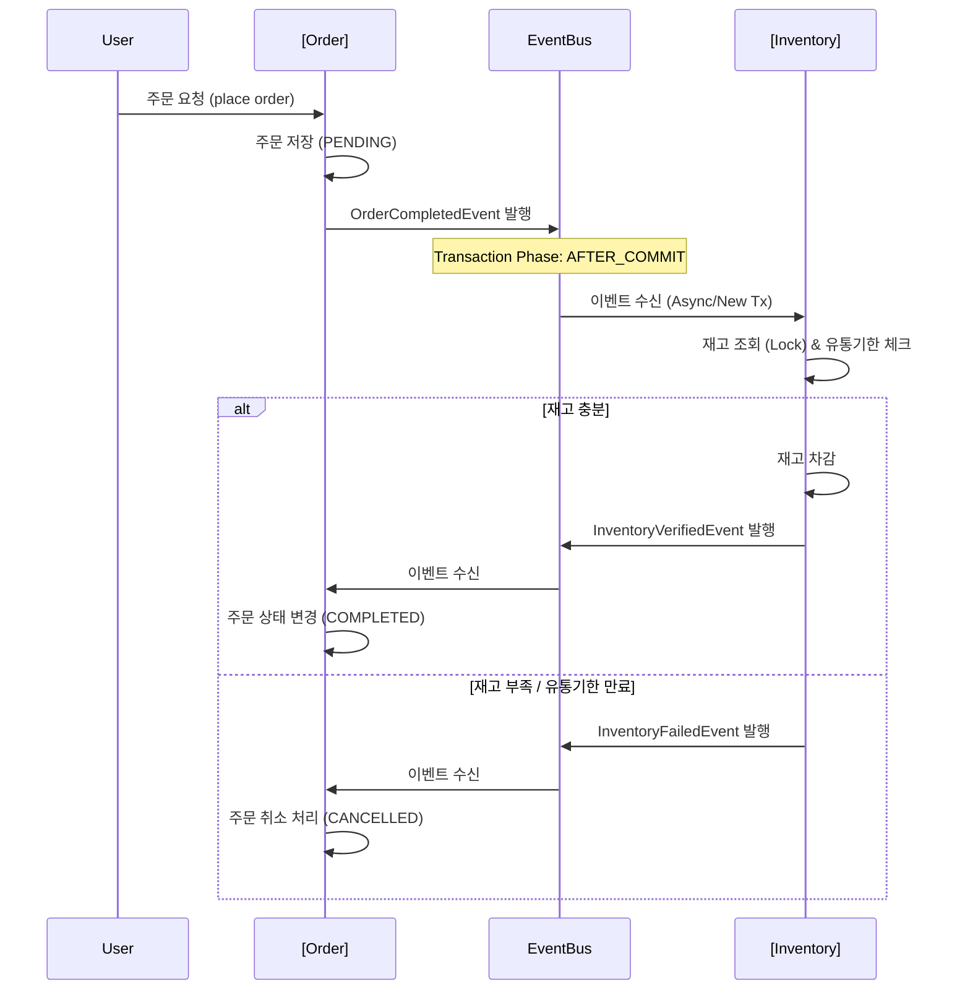

# Demo Modulish Project

이 프로젝트는 **Spring Boot**와 **Spring Modulith**를 활용하여 모듈형 모놀리스(Modular Monolith) 아키텍처를 구현한 예제 애플리케이션입니다.

주문(Order)과 재고(Inventory) 시스템 간의 결합도를 낮추기 위해 **Spring ApplicationEvent**를 활용한 이벤트 기반 통신을 구현하였으며, 비동기 처리 및 보상 트랜잭션(Compensation Transaction) 로직을 포함하고 있습니다.

## 🏗 Architecture

이 프로젝트는 논리적으로 분리된 모듈(`order`, `inventory`, `payment`)로 구성되어 있으며, 각 모듈은 내부 구현을 숨기고 공개된 API(이벤트 등)를 통해서만 상호작용합니다.

### Event-Driven Flow (주문 프로세스)

주문 생성부터 재고 차감, 최종 확정까지의 흐름은 다음과 같습니다.



## 🛠 Tech Stack

- **Java**: 17+
- **Framework**: Spring Boot 3.x
- **Architecture**: Spring Modulith
- **Database**: H2 (In-memory), Spring Data JPA
- **Build Tool**: Gradle (Kotlin DSL)
- **Testing**: JUnit 5, AssertJ, Awaitility (비동기 테스트), Spring Modulith Test

## 📦 Modules

### 1. Order (`com.demomodulish.order`)
- **역할**: 주문 생성 및 상태 관리
- **주요 로직**:
  - 주문 생성 시 `PENDING` 상태로 저장 후 이벤트 발행.
  - 재고 확인 성공(`InventoryVerifiedEvent`) 시 `COMPLETED`로 변경.
  - 재고 부족 실패(`InventoryFailedEvent`) 시 `CANCELLED`로 변경 (보상 트랜잭션).

### 2. Inventory (`com.demomodulish.inventory`)
- **역할**: 상품 재고 관리 및 차감 로직
- **주요 로직**:
  - **FIFO (선입선출)**: 유통기한이 임박한 재고부터 우선 차감.
  - **동시성 제어**: `Pessimistic Lock`을 사용하여 재고 차감 시 동시성 이슈 방지.
  - **유효성 검사**: 유통기한이 지난 재고는 차감 대상에서 제외.

### 3. Common (`com.demomodulish.common`)
- **역할**: 모듈 간 통신을 위한 공유 이벤트 객체 (POJO/Record) 정의.

## 🧪 Testing

프로젝트는 단위 테스트, 모듈 테스트, 그리고 전체 시스템 통합 테스트를 포함합니다.

### 통합 테스트 (E2E)
`SystemIntegrationTests` 클래스는 실제 애플리케이션 컨텍스트를 띄워 전체 흐름을 검증합니다.
- **성공 시나리오**: 주문 -> 재고 차감 -> 주문 완료 확인.
- **실패 시나리오**: 재고 부족 시 주문 취소 확인.
- **엣지 케이스**: 유통기한 만료된 재고만 있을 경우 주문 취소 확인.

### 테스트 실행 방법
```bash
# 전체 테스트 실행
./gradlew test

# 통합 테스트만 실행
./gradlew test --tests "com.demomodulish.SystemIntegrationTests"
```

## 🚀 Getting Started

1. **프로젝트 클론**
   ```bash
   git clone <repository-url>
   cd demo-modulish
   ```

2. **애플리케이션 실행**
   ```bash
   ./gradlew bootRun
   ```

3. **H2 콘솔 접속 (Optional)**
   - URL: `http://localhost:8080/h2-console`
   - JDBC URL: `jdbc:h2:mem:testdb` (application.properties 설정에 따라 다를 수 있음)
